# BinaryGAN

Generating binarized MNIST digits using Generative Adversarial Networks with
Binary Neurons

## Stochastic and Deterministic Binary Neurons

*Binary neurons* (BNs) are neurons that output binary-valued predictions. In
this work, we consider two types of BNs:

- *Deterministic Binary Neurons* (**DBNs**) act like neurons with hard
  thresholding functions as their activation functions. We define the output of
  a DBN for a real-valued input *x* as *DBN*(*x*) = **1**<sub>*x*>0</sub>,
  where **1**<sub>(&middot;)</sub> is the indicator function.

- *Stochastic Binary Neurons* (**SBNs**) binarize a real-valued input *x*
  according to a probability, defined as *SBN*(*x*) = **1**<sub>*z*<*σ*(*x*)</sub>, *z*~*U*[0, 1], where &sigma;(&middot;) is the logistic sigmoid function and *U*[0, 1] denotes
  an uniform distribution.

The implementation of binary neurons are mostly based on the code provided in a
[blog post](https://r2rt.com/binary-stochastic-neurons-in-tensorflow.html)
on R2RT blog &mdash; "*Binary Stochastic Neurons in Tensorflow*" [1].

## Run the code

### Prepare Training Data

- Download MNIST database by running the script:
    ```sh
    ./data/download_mnist.sh
    ```
- or download it manually:
    1. Download MNIST database [here](http://yann.lecun.com/exdb/mnist/)
    2. Uncompress all the `.gz` files
    3. Move the uncompressed files to `data/mnist`

#### (optional) Store the data to shared memory

```sh
python data/load_mnist_to_sa.py ./data/mnist --binary --onehot --merge
```

### Configuration

Modify `config.py` for configuration.

- Quick setup

  Change the values in the dictionary `SETUP` for a quick setup. Documentation
  is provided right after each key.

- More configuration options

  Four dictionaries `EXP_CONFIG`, `DATA_CONFIG`, `MODEL_CONFIG` and
  `TRAIN_CONFIG` define experiment-, data-, model- and training-related
  configuration variables, respectively.

  > The automatically-determined experiment name is based only on the values
defined in the dictionary `SETUP`, so remember to provide the experiment name
manually (so that you won't overwrite a trained model).

### Run

```sh
python main.py
```

## Results

Three GAN training algorithm are examined:

- **GAN** &mdash; non-sturating GAN [2]
- **WGAN** &mdash; Wasserstein GAN with weight clipping [3]
- **WGAN-GP** &mdash; Wasserstein GAN with gradient penalty [4]

### WGAN-GP (Wasserstein GAN with gradient penalty)

#### MLP + DBNs (WGAN-GP)

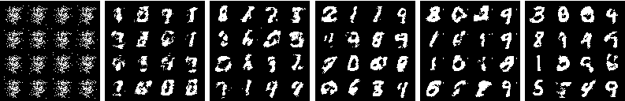
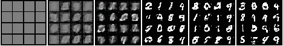

**Top** &mdash; results (binary-valued predictions)<br>
**Bottom** &mdash; raw probabilistic predictions

#### MLP + SBNs (WGAN-GP)

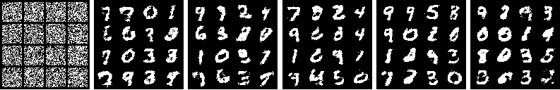
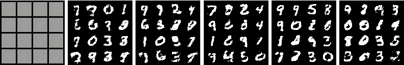

**Top** &mdash; results (binary-valued predictions)<br>
**Bottom** &mdash; raw probabilistic predictions

#### MLP with real-valued outputs (WGAN-GP)

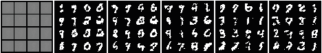
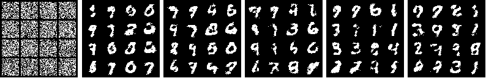
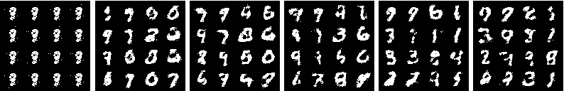

**Top** &mdash; results (real-valued predictions)<br>
**Middle** &mdash; binarized predictions with threshold=0.5<br>
**Bottom** &mdash; binarized predictions using Bernoulli sampling

### GAN (non-sturating GAN)

#### MLP + DBNs (GAN)

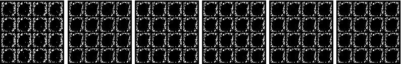
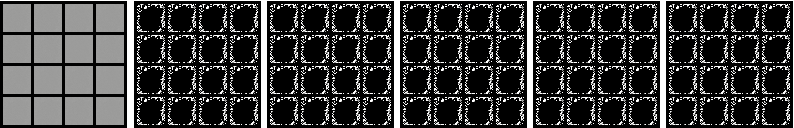

**Top** &mdash; results (binary-valued predictions)<br>
**Bottom** &mdash; raw probabilistic predictions

#### MLP + SBNs (GAN)

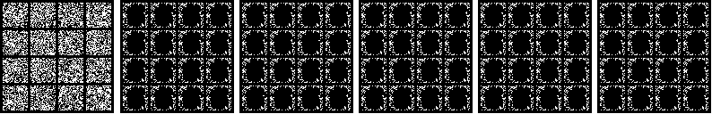
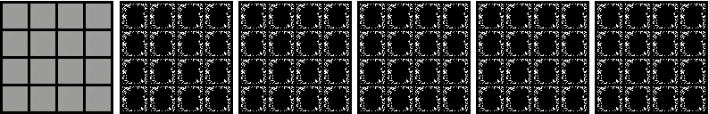

**Top** &mdash; results (binary-valued predictions)<br>
**Bottom** &mdash; raw probabilistic predictions

### WGAN (Wesserstein GAN with weight clipping)

#### MLP + DBNs (WGAN)

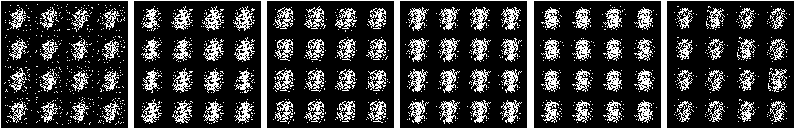
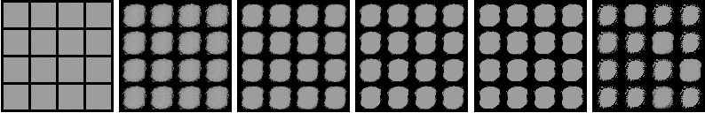

**Top** &mdash; results (binary-valued predictions)<br>
**Bottom** &mdash; raw probabilistic predictions

#### MLP + SBNs (WGAN)

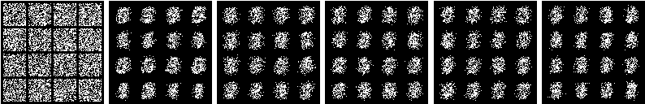
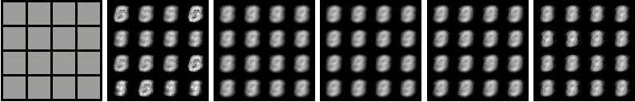

**Top** &mdash; results (binary-valued predictions)<br>
**Bottom** &mdash; raw probabilistic predictions

## References

1. Binary Stochastic Neurons in Tensorflow, 2016.
   Blog post on R2RT blog.
   [[link](https://r2rt.com/binary-stochastic-neurons-in-tensorflow.html)]

2. Ian J. Goodfellow, Jean Pouget-Abadie, Mehdi Mirza, Bing Xu, David
   Warde-Farley, Sherjil Ozair, Aaron Courville, and Yoshua Bengio,
   "Generative Adversarial Networks,"
   in *Proc. NIPS*, 2014.

3. Martin Arjovsky, Soumith Chintala, and Léon Bottou.
   "Wasserstein Generative Adversarial Networks",
   in *Proc. ICML*, 2017.

4. Ishaan Gulrajani, Faruk Ahmed, Martin Arjovsky, Vincent Dumoulin, and Aaron
   Courville,
   "Improved Training of Wasserstein GANs,"
   in *Proc. NIPS*, 2017.