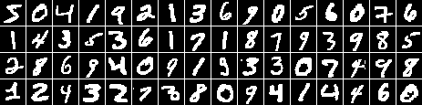

# Data

We use the binarized version of the MNIST handwritten digit database.
Specifically, we

- convert pixels with nonzero intensities to ones
- convert pixels with zero intensities to zeros.

The following figure shows some sample binarized MNIST digits seen in our
training data.

Sample binarized MNIST digits

