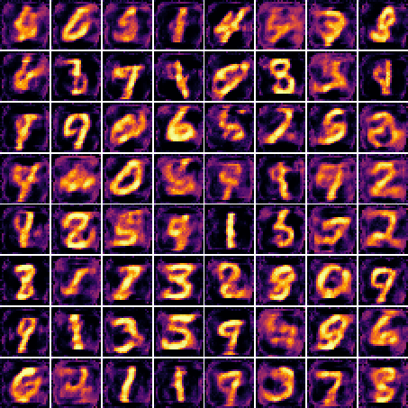
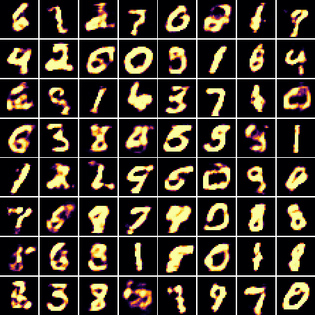

[BinaryGAN](https://salu133445.github.io/binarygan) is a novel generative
adversarial network (GAN) that uses binary neurons at the output layer of the
generator. We employ the sigmoid-adjusted straight-through estimators to
estimate the gradients for the binary neurons and train the whole network by
end-to-end backpropogation. The proposed model is able to directly generate
binary-valued predictions at test time.

We implement such a model to generate binarized MNIST digits and experimentally
compare the performance for different types of binary neurons, GAN objectives
and network architectures. Although the results are still preliminary, we show
that it is possible to train a GAN that has binary neurons and that the use of
gradient estimators can be a promising direction for modeling discrete
distributions with GANs.

For reproducibility, the source code is available
[here](https://github.com/salu133445/binarygan).
