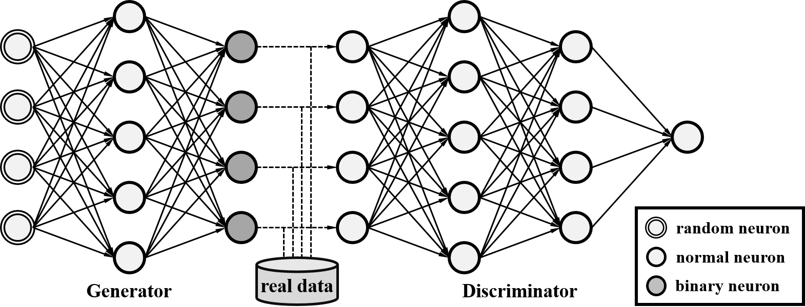

# Model

The proposed model consists of a _generator G_ and a _discriminator D_. The
generator takes as input a random vector _z_ drawn from a prior distribution
_pz_ and generate a fake sample _G_(_z_). The discriminator takes as
input either a real sample drawn from the data distribution or a fake sample
generated by the generator and outputs a scalar indicating the genuineness of
that sample. The discriminator is trained to tell the fake data from the real
ones. The generator is trained to fool the discriminator.

In order to handle binary data, we propose to use [binary neurons](neurons),
either deterministic or stochastic ones, at the output layer (i.e., the final
layer) of the generator. We employ the
[sigmoid-adjusted straight-through estimators](neurons) to estimate the
gradients for binary neurons and train the whole network by end-to-end
backpropagation.

The following is the system diagram for the proposed model implemented by
multilayer perceptrons (MLPs).

